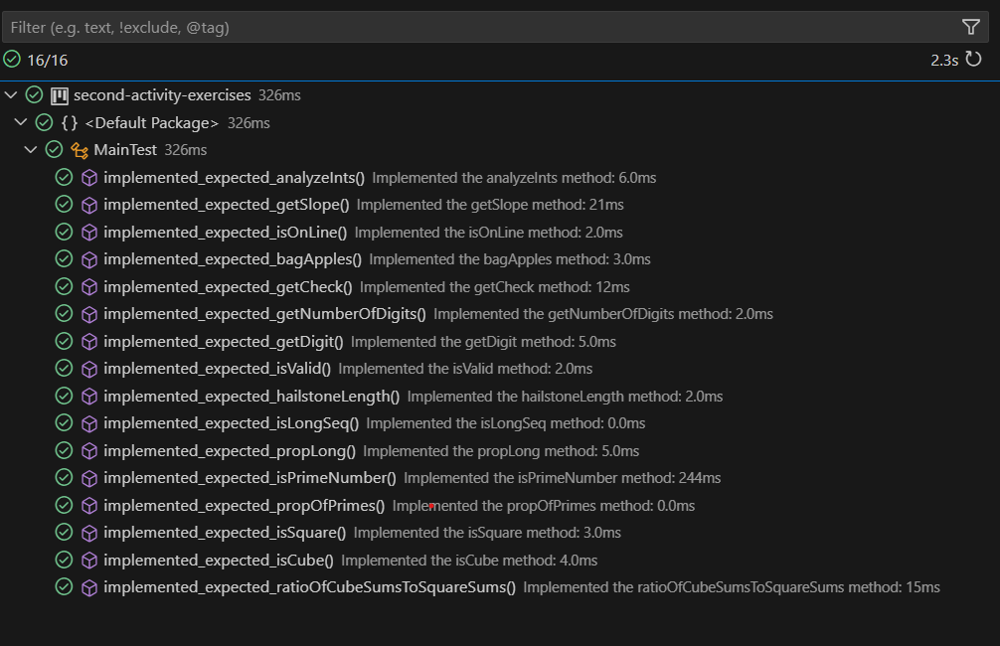

# AP Computer Science A - Quiz Unit 1: Free Questions

This document contains a series of exercises designed to test knowledge and problem-solving skills in Java programming. Below is a brief summary of each exercise.

## Exercise Summaries

### Question 2: Integer Analysis
This exercise focuses on analyzing integer values using the `IntegerAnalysis` class. The tasks include:
- **Analyzing Integer Values:** Implement a method to calculate the proportion of values that meet specific criteria (e.g., being divisible by 3).

### Question 3: APLine Class Implementation
This exercise requires implementing an `APLine` class that represents a mathematical line defined by the equation `ax + by + c = 0`. The tasks include:
- **Calculating Slope:** Implement a method to calculate the slope of the line.
- **Checking Points on the Line:** Implement a method to check if a given point lies on the line.

### Question 4: Apple Bagger
In this exercise, the `AppleBagger` class is used to manage the process of adding apples to a bag. The tasks include:
- **Bagging Apples:** Implement a method to determine how many apples can be added to a bag before exceeding a specified weight limit.

### Question 5: Check Digit Calculation
This exercise involves implementing methods in the `CheckDigit` class to calculate and verify check digits, which are used for error detection in numerical data. The tasks include:
- **Calculating Check Digits:** Implement a method to compute the check digit for a number.
- **Validating Numbers:** Implement a method to verify if a number with a check digit is valid.

### Question 9: Hailstone Sequence
This exercise focuses on calculating and analyzing hailstone sequences using the `Hailstone` class. The tasks include:
- **Calculating Sequence Length:** Implement a method to determine the length of a hailstone sequence.
- **Checking Sequence Length:** Implement a method to check if the sequence is longer than its starting value.
- **Proportion of Long Sequences:** Implement a method to calculate the proportion of sequences that are considered long.

### Question 11: Prime Number Analysis
This exercise involves working with prime numbers using the `PrimeNumber` class. The tasks include:
- **Proportion of Prime Numbers:** Implement a method to calculate the proportion of prime numbers within a given range.

### Question 12: Number Properties
In this exercise, the `NumberProperties` class is used to analyze properties of numbers. The tasks include:
- **Ratio of Sums:** Implement a method to calculate the ratio of the sum of perfect cubes to the sum of perfect squares within a given range.

NO SE LINKEAR LA IMAGEN

